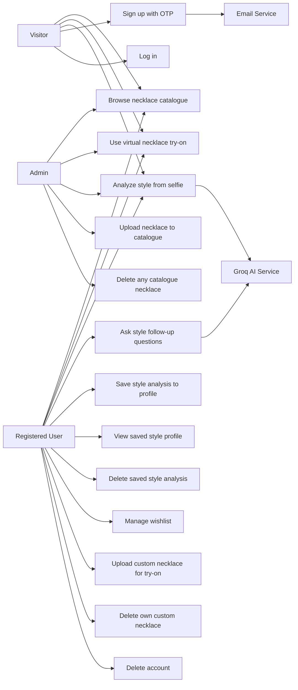
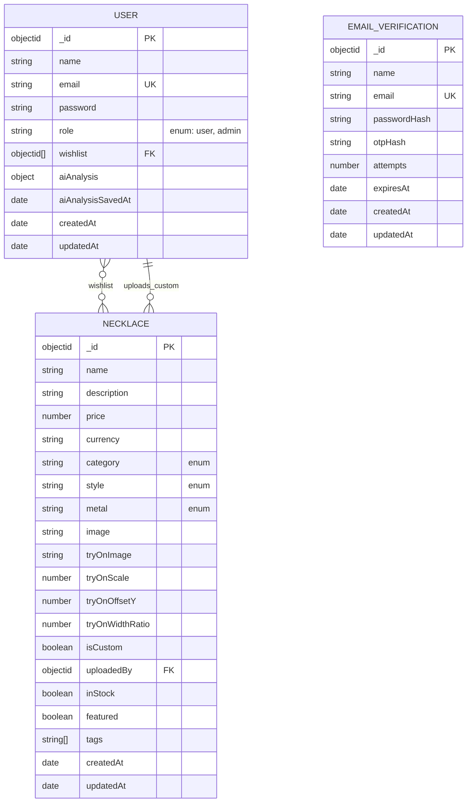
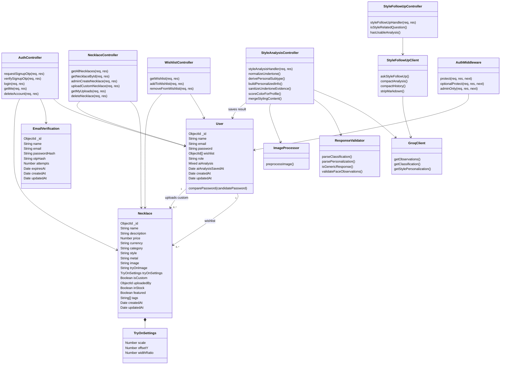
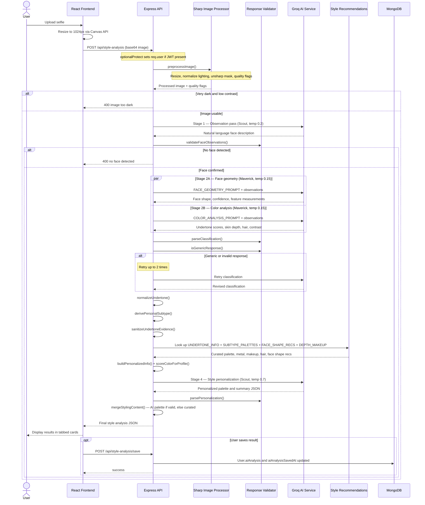
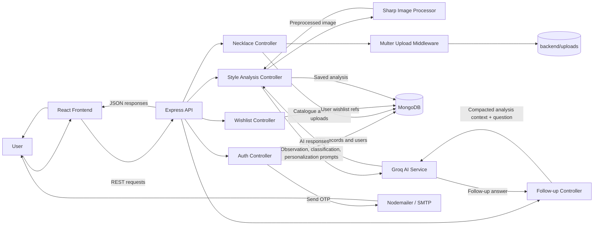
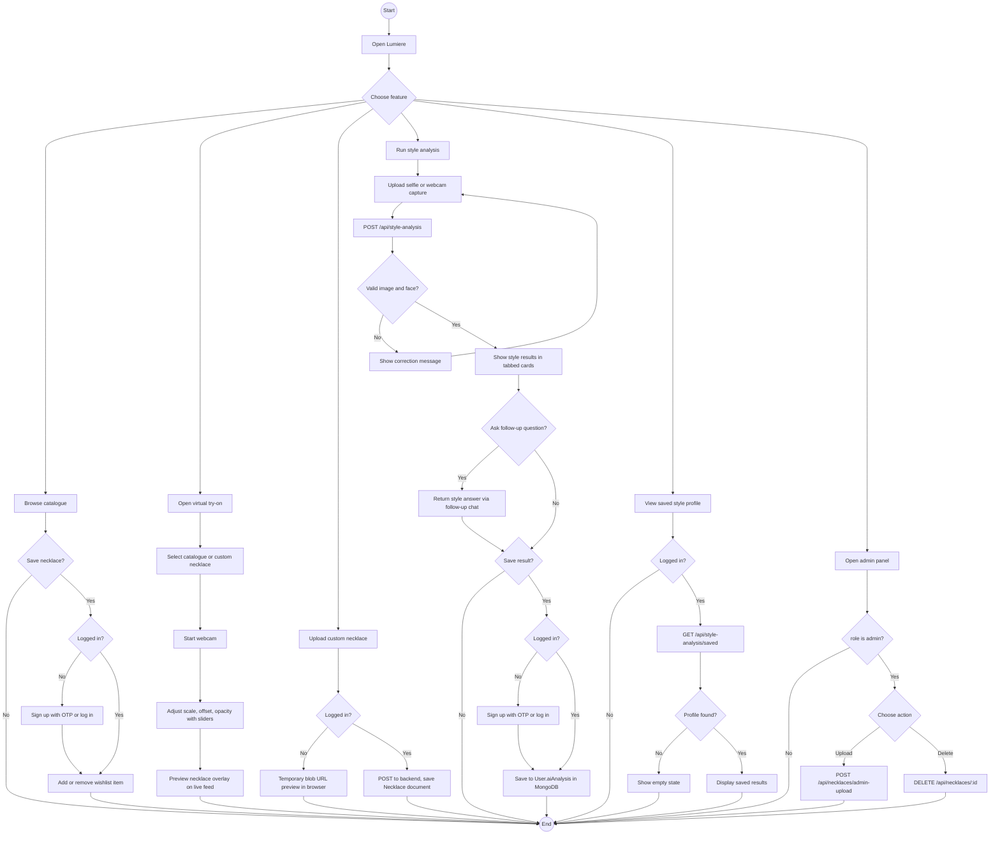

# Diagrams

These diagrams describe the current Lumiere React frontend, Express backend, and MongoDB data model.

## Use Case Diagram

## E-R Diagram

## Class Diagram

## AI Style Analysis Sequence

## Data Flow Diagram

## Activity Diagram

## Database Implementation Notes

| Collection | Model | Purpose |
|---|---|---|
| `users` | `User` | Accounts, hashed passwords, role, wishlist references, and saved AI analysis |
| `necklaces` | `Necklace` | Public catalogue necklaces and user custom uploads in one collection |
| `emailverifications` | `EmailVerification` | Temporary OTP signup records, auto-deleted by TTL index after 10 minutes |

- `User.role` is either `'user'` (default) or `'admin'`. Admin role is assigned via `node backend/makeAdmin.js`.
- `User.wishlist` stores an array of `ObjectId` references to `Necklace` documents.
- `User.aiAnalysis` is `Mixed` type — stores the full AI result object without a rigid schema.
- Custom uploads use `isCustom: true` and `uploadedBy` (ObjectId ref to the uploader). Public catalogue records use `isCustom: false` and no `uploadedBy`.
- `Necklace.tryOnSettings` embeds `scale`, `offsetY`, and `widthRatio` — the single source of truth for try-on rendering calibration.
- Uploaded image files are stored in `backend/uploads/`. MongoDB stores only the URL path string.
- `EmailVerification` has no foreign key to `User`. It is a standalone temporary document keyed by email. On successful OTP verification, a new `User` document is created and the `EmailVerification` record is immediately deleted.
