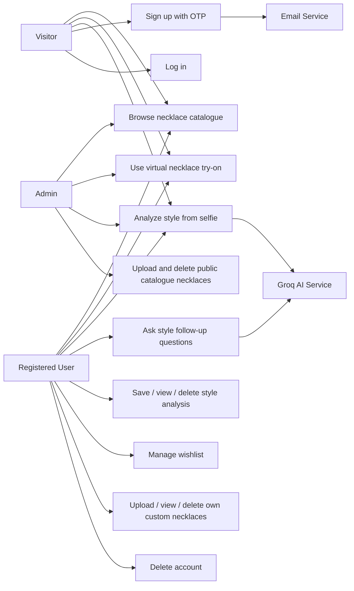
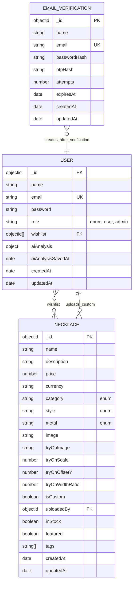
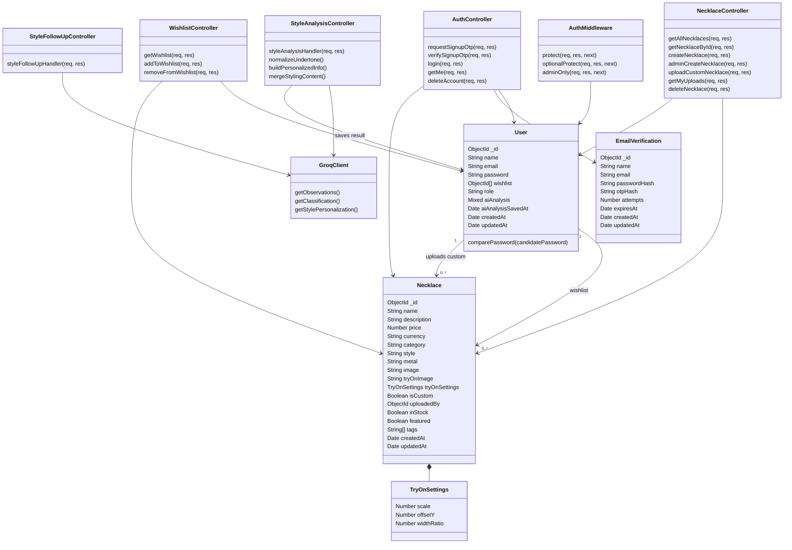
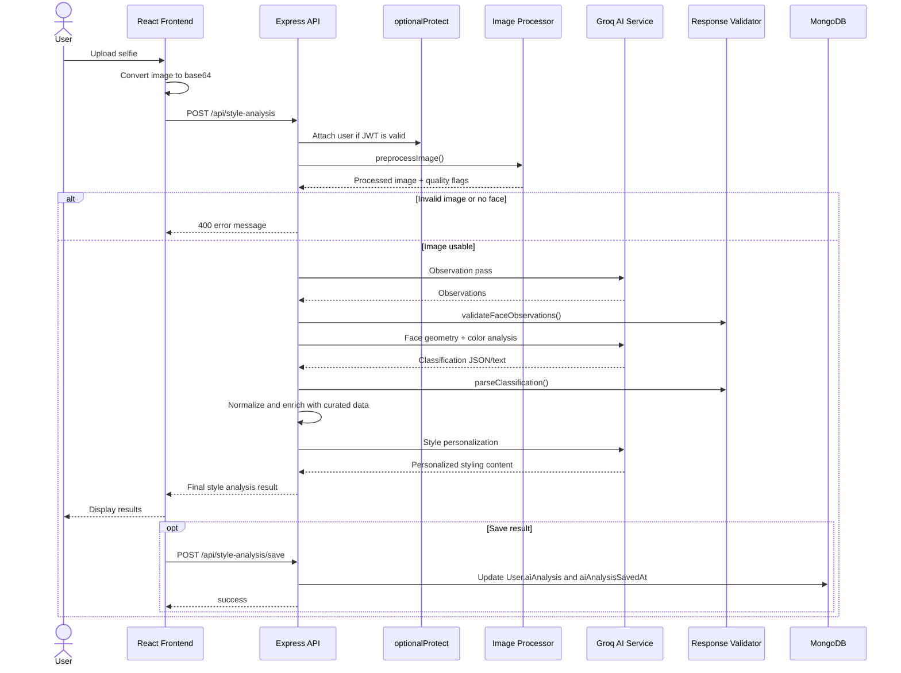

# Diagrams

These diagrams describe the current Lumiere React frontend, Express backend, and MongoDB data model.

## Use Case Diagram



## E-R Diagram



## Class Diagram



## AI Style Analysis Sequence



## Data Flow Diagram

```mermaid
flowchart LR
  user["User"]
  frontend["React Frontend"]
  api["Express API"]
  auth["Auth Controller"]
  necklace["Necklace Controller"]
  wishlist["Wishlist Controller"]
  styleanalysis["Style Analysis / Follow-up Controllers"]
  upload["Multer Upload Middleware"]
  db[("MongoDB")]
  files[("backend/uploads")]
  ai["Groq AI Service"]
  email["Nodemailer / SMTP"]

  user --> frontend
  frontend -->|"REST requests"| api

  api --> auth
  api --> necklace
  api --> wishlist
  api --> style

  auth -->|"OTP records and users"| db
  auth -->|"Send OTP"| email
  email --> user

  necklace -->|"Catalogue, custom uploads, admin changes"| db
  necklace --> upload
  upload --> files
  wishlist -->|"User wishlist refs"| db

  styleanalysis -->|"Preprocessed image / prompts"| ai
  ai -->|"Observations, classification, personalization"| style
  styleanalysis -->|"Saved analysis"| db

  api --> frontend
  frontend --> user
```

## Activity Diagram

```mermaid
flowchart TD
  start((Start)) --> openApp["Open Lumiere"]
  openApp --> choose{"Choose feature"}

  choose --> catalogue["Browse catalogue"]
  catalogue --> wishlist{"Save necklace?"}
  wishlist -->|No| endNode((End))
  wishlist -->|Yes| auth1{"Logged in?"}
  auth1 -->|No| authWish["Sign up with OTP or log in"]
  auth1 -->|Yes| saveWish["Add / remove wishlist item"]
  authWish --> saveWish --> endNode

  choose --> tryon["Open virtual try-on"]
  tryon --> select["Select catalogue or uploaded necklace"]
  select --> camera["Start webcam"]
  camera --> adjust["Adjust scale, offset, opacity"]
  adjust --> preview["Preview necklace on live camera"] --> endNode

  choose --> custom["Upload custom necklace"]
  custom --> auth2{"Logged in?"}
  auth2 -->|No| tempUpload["Temporary browser preview"]
  auth2 -->|Yes| persistUpload["Save image and Necklace document"]
  tempUpload --> endNode
  persistUpload --> endNode

  choose --> style["Run style analysis"]
  style --> selfie["Upload selfie"]
  selfie --> analyze["POST /api/style-analysis"]
  analyze --> valid{"Valid image and face?"}
  valid -->|No| fix["Show correction message"] --> selfie
  valid -->|Yes| results["Show style results"]
  results --> followup{"Ask follow-up?"}
  followup -->|Yes| answer["Return style answer"] --> save{"Save result?"}
  followup -->|No| save
  save -->|No| endNode
  save -->|Yes| auth3{"Logged in?"}
  auth3 -->|No| authSave["Sign up with OTP or log in"]
  auth3 -->|Yes| saveProfile["Save to User.aiAnalysis"] --> endNode
  authSave --> saveProfile

  choose --> admin["Open admin panel"]
  admin --> role{"role is admin?"}
  role -->|No| endNode
  role -->|Yes| manage["Upload or delete catalogue necklace"]
  manage --> endNode
```

## Database Implementation Notes

| Collection | Model | Purpose |
|---|---|---|
| `users` | `User` | Accounts, hashed passwords, role, wishlist references, and saved AI analysis |
| `necklaces` | `Necklace` | Public catalogue necklaces and user custom uploads |
| `emailverifications` | `EmailVerification` | Temporary OTP signup records with TTL expiry |

- `User.role` controls regular user versus admin access.
- `User.wishlist` stores `ObjectId` references to `Necklace`.
- Custom uploads are `Necklace` records with `isCustom: true` and `uploadedBy`.
- Public catalogue records use `isCustom: false`.
- Uploaded image files are stored in `backend/uploads`; MongoDB stores URL paths.
- Saved style analysis is stored on `User.aiAnalysis` with `aiAnalysisSavedAt`.
