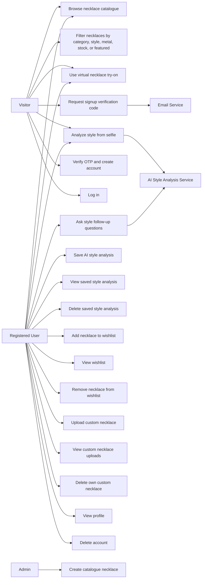
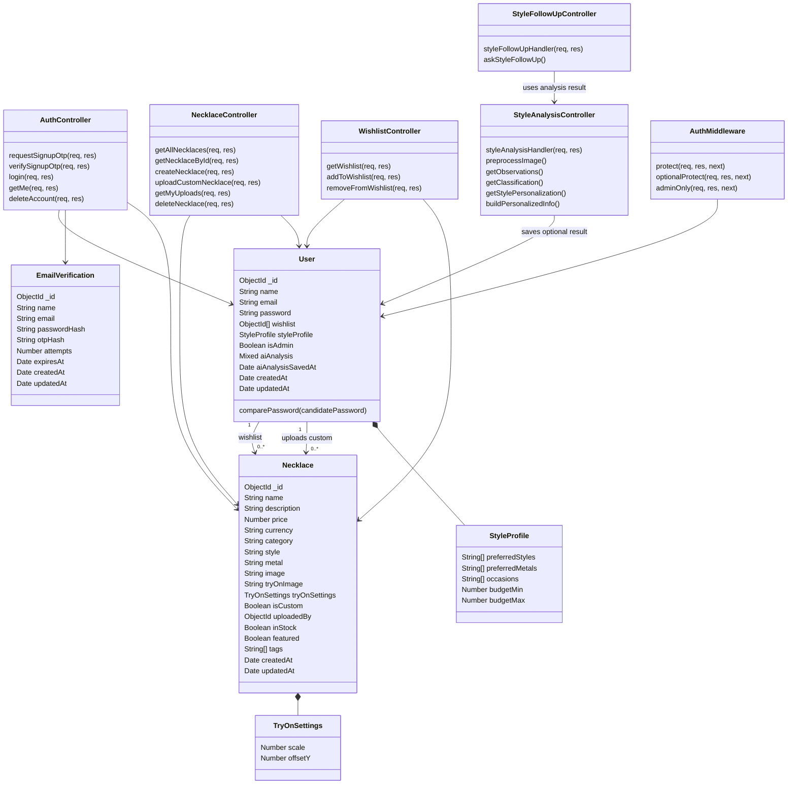
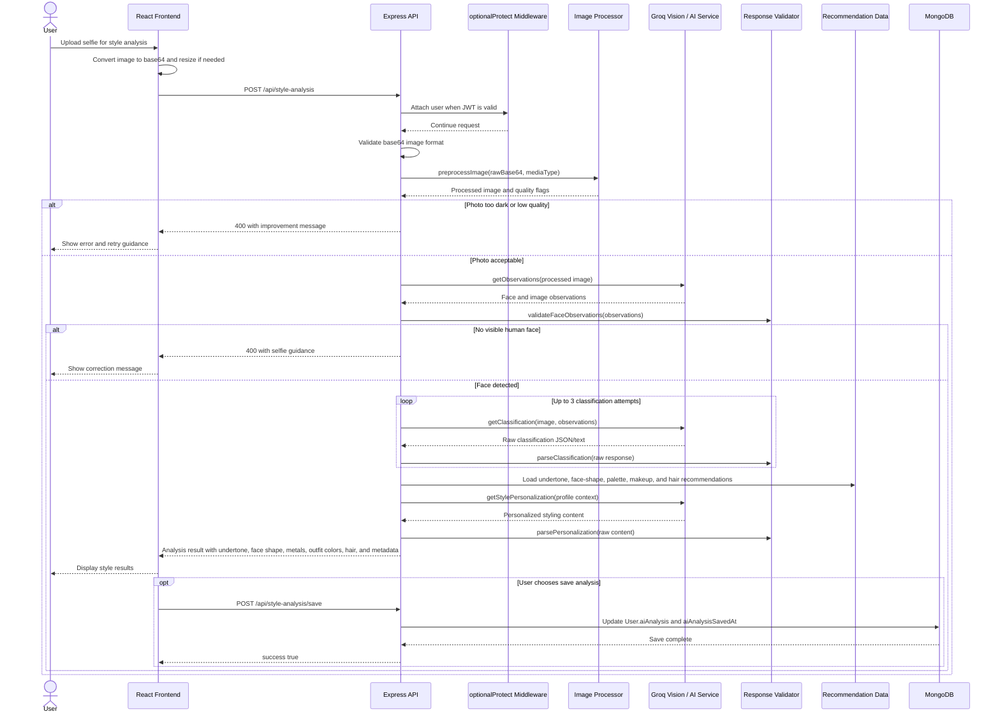

# UML Modeling Diagrams

These diagrams describe the Lumiere jewelry styling application based on the current React frontend and Express/MongoDB backend.

## Use Case Diagram



# Data Modeling

## E-R Diagram

```mermaid
erDiagram
  USER {
    objectid _id PK
    string name
    string email UK
    string password
    boolean isAdmin
    object aiAnalysis
    date aiAnalysisSavedAt
    date createdAt
    date updatedAt
  }

  STYLE_PROFILE {
    string preferredStyles
    string preferredMetals
    string occasions
    number budgetMin
    number budgetMax
  }

  NECKLACE {
    objectid _id PK
    string name
    string description
    number price
    string currency
    string category
    string style
    string metal
    string image
    string tryOnImage
    number tryOnScale
    number tryOnOffsetY
    boolean isCustom
    objectid uploadedBy FK
    boolean inStock
    boolean featured
    string tags
    date createdAt
    date updatedAt
  }

  EMAIL_VERIFICATION {
    objectid _id PK
    string name
    string email UK
    string passwordHash
    string otpHash
    number attempts
    date expiresAt
    date createdAt
    date updatedAt
  }

  USER ||--|| STYLE_PROFILE : has
  USER }o--o{ NECKLACE : wishlist
  USER ||--o{ NECKLACE : uploads
  USER ||--o| EMAIL_VERIFICATION : verifies_signup_with
```



## Data Flow Diagram

```mermaid
flowchart LR
  user[User]
  frontend[React Frontend]
  api[Express API]
  auth[Authentication Controller]
  necklace[Necklace Controller]
  wishlist[Wishlist Controller]
  style[Style Analysis Controller]
  upload[Upload Middleware]
  db[(MongoDB Database)]
  files[(Uploads Folder)]
  ai[Groq AI Service]
  email[Email Service]

  user -->|Signup, login, browse, try-on, style requests| frontend
  frontend -->|HTTP requests| api

  api --> auth
  api --> necklace
  api --> wishlist
  api --> style

  auth -->|Create pending OTP, create user, read profile| db
  auth -->|Send verification code| email
  email -->|OTP email| user

  necklace -->|Read catalogue and custom necklaces| db
  necklace -->|Upload custom necklace image| upload
  upload -->|Store image file| files
  upload -->|File path / filename| necklace
  necklace -->|Save uploaded necklace metadata| db

  wishlist -->|Read / update user wishlist| db

  style -->|Preprocessed selfie and prompts| ai
  ai -->|Observations, classification, personalization| style
  style -->|Save / read / delete AI analysis| db

  api -->|JSON responses| frontend
  frontend -->|Rendered pages and results| user
```

## Database Implementation

The project uses MongoDB with Mongoose in the Express backend. The connection is created in `backend/config/db.js` and initialized from `backend/server.js` before the API routes are registered.

Main collections:

| Collection | Mongoose Model | Purpose |
|---|---|---|
| `users` | `User` | Stores registered users, hashed passwords, wishlist references, legacy style profile data, admin flag, and saved AI analysis results. |
| `necklaces` | `Necklace` | Stores catalogue necklaces and user-uploaded custom necklaces, including try-on image paths and display metadata. |
| `emailverifications` | `EmailVerification` | Temporarily stores signup OTP details until the user verifies their email. Expired records are removed through a TTL index. |

Important implementation details:

- User passwords are hashed with `bcryptjs` before saving.
- Authentication uses JWT tokens; protected routes use the `protect` middleware.
- `User.wishlist` stores an array of `ObjectId` references to `Necklace`.
- Custom necklaces are linked to their owner through `Necklace.uploadedBy`.
- Uploaded necklace files are saved in `backend/uploads`, while the database stores their URL paths.
- AI style analysis results are stored directly on the user document in `User.aiAnalysis`.
- The `Necklace` model defines indexes for category/style filtering, featured items, and uploaded necklaces.
- The `EmailVerification.expiresAt` field has a TTL index so pending signup records expire automatically.

## Class Diagram



## Sequence Diagram

This sequence shows the main AI style analysis workflow, including optional saving for authenticated users.



## Activity Diagram

```mermaid
flowchart TD
  start((Start))
  openApp["Open Lumiere web app"]
  chooseFeature{"Choose feature"}

  catalogue["Browse jewellery catalogue"]
  filters["Apply necklace filters"]
  necklaceDetails["View necklace details"]
  wishlistDecision{"Logged in and wants wishlist?"}
  authForWishlist{"User has account?"}
  addWishlist["Add or remove necklace from wishlist"]

  tryon["Open virtual try-on"]
  selectNecklace["Select catalogue or uploaded necklace"]
  uploadPhoto["Upload user photo"]
  adjustTryon["Adjust scale and vertical offset"]
  previewTryon["Preview necklace on photo"]

  style["Open Find Your Style"]
  uploadSelfie["Upload selfie"]
  analyze["Submit photo for AI analysis"]
  qualityCheck{"Image valid and face visible?"}
  showFix["Show photo improvement message"]
  showResults["Show undertone, face shape, metal, palette, makeup, and hair recommendations"]
  followUp{"Ask follow-up question?"}
  answerFollowUp["Return style-related answer"]
  saveChoice{"Save result?"}
  authForSave{"Logged in?"}
  saveResult["Save result to user profile"]

  authenticateWishlist["Sign up with OTP or log in"]
  authenticateSave["Sign up with OTP or log in"]

  customUpload{"Upload custom necklace?"}
  uploadNecklace["Upload PNG or WebP necklace image"]
  storeCustom["Store custom necklace in MongoDB and uploads folder"]

  end((End))

  start --> openApp --> chooseFeature

  chooseFeature --> catalogue
  catalogue --> filters --> necklaceDetails --> wishlistDecision
  wishlistDecision -->|Yes| authForWishlist
  wishlistDecision -->|No| end
  authForWishlist -->|No| authenticateWishlist
  authForWishlist -->|Yes| addWishlist
  authenticateWishlist --> addWishlist --> customUpload
  customUpload -->|Yes| uploadNecklace --> storeCustom --> end
  customUpload -->|No| end

  chooseFeature --> tryon
  tryon --> selectNecklace --> uploadPhoto --> adjustTryon --> previewTryon --> end

  chooseFeature --> style
  style --> uploadSelfie --> analyze --> qualityCheck
  qualityCheck -->|No| showFix --> uploadSelfie
  qualityCheck -->|Yes| showResults --> followUp
  followUp -->|Yes| answerFollowUp --> saveChoice
  followUp -->|No| saveChoice
  saveChoice -->|Yes| authForSave
  saveChoice -->|No| end
  authForSave -->|No| authenticateSave
  authForSave -->|Yes| saveResult
  authenticateSave --> saveResult --> end
```
